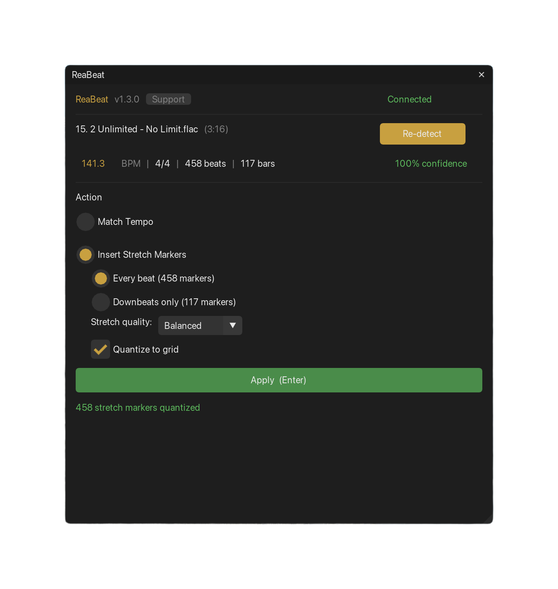

# ReaBeat

**Neural beat detection and tempo mapping for REAPER.**


ReaBeat detects beats, downbeats, tempo, and time signature in any audio using [beat-this](https://github.com/CPJKU/beat_this) (CPJKU, ISMIR 2024), then writes results to REAPER as tempo markers, stretch markers, or adjusts playrate to match your session tempo.



## What It Does

- **Detect beats** - state-of-the-art neural beat tracking, ~2-3 seconds per song
- **Match tempo** - one click to adjust playrate to project BPM or custom target (pitch preserved, auto-aligned to bar)
- **Insert tempo map** - constant BPM or variable per-bar markers (snaps to grid)
- **Insert stretch markers** - at every beat or every downbeat, with quality mode selection (Balanced/Transient/Tonal)
- **Match & Quantize** - combo: tempo map + quantized stretch markers in one click
- **Editable BPM** - override detected tempo when you know better
- **Neural downbeats** - accurate bar boundary detection using dedicated model head
- **Multi-item cache** - switch between items without losing detection results
- **Cross-platform** - macOS, Windows, Linux

## Use Cases

- **Tempo-map a live recording** — align REAPER's grid to freely played audio
- **Match a song to your session** — detect BPM, one click to match project tempo
- **Quantize timing** — insert stretch markers, then fine-tune in REAPER
- **Sync to picture** — create accurate tempo map for scoring workflows
- **Prep for editing** — know the BPM and bar structure before you start cutting

---

## Installation

### Quick Install (macOS / Linux)

Open Terminal, paste this, press Enter:
```bash
curl -sSL https://raw.githubusercontent.com/b451c/ReaBeat/main/install.sh | bash
```

### Quick Install (Windows)

Open PowerShell, paste this, press Enter:
```powershell
irm https://raw.githubusercontent.com/b451c/ReaBeat/main/install.ps1 | iex
```

### Step-by-Step Install (all platforms)

<details>
<summary>Click to expand full manual installation guide</summary>

#### Step 1: Install uv (Python package manager)

**macOS / Linux:**
```bash
curl -LsSf https://astral.sh/uv/install.sh | sh
```

**Windows (PowerShell):**
```powershell
irm https://astral.sh/uv/install.ps1 | iex
```

#### Step 2: Download ReaBeat

**macOS / Linux:**
```bash
cd ~/Documents
git clone https://github.com/b451c/ReaBeat.git
cd ReaBeat
```

**Windows (PowerShell):**
```powershell
cd $env:USERPROFILE\Documents
git clone https://github.com/b451c/ReaBeat.git
cd ReaBeat
```

> Don't have git? Download ZIP: https://github.com/b451c/ReaBeat/archive/refs/heads/main.zip

#### Step 3: Install Python dependencies

```bash
uv sync
```

This downloads Python, PyTorch, beat-this and all dependencies (~800MB, one-time).

Verify it works:
```bash
uv run python -m reabeat check
```
You should see: `OK: beat-this ready`

#### Step 4: Install REAPER dependencies

Open REAPER, then:

1. **Extensions > ReaPack > Import repositories**
2. Paste this URL, click OK:
   ```
   https://github.com/mavriq-dev/public-reascripts/raw/master/index.xml
   ```
3. **Extensions > ReaPack > Browse packages**
4. Search and install these two:
   - **ReaImGui** (required — the UI framework)
   - **mavriq-lua-sockets** (required — backend communication)
5. Restart REAPER after installing both

Recommended: also install [SWS Extension](https://www.sws-extension.org/) (enables URL opening from Support menu).

#### Step 5: Add ReaBeat script to REAPER

1. **Actions > Show action list**
2. Click **New action... > Load ReaScript...**
3. Navigate to the `reabeat.lua` file:
   - **macOS / Linux:** `~/Documents/ReaBeat/scripts/reaper/reabeat.lua`
   - **Windows:** `Documents\ReaBeat\scripts\reaper\reabeat.lua`
   - If you used the auto-installer, scripts are already in REAPER's Scripts folder:
     - **macOS:** `~/Library/Application Support/REAPER/Scripts/ReaBeat/reabeat.lua`
     - **Windows:** `%APPDATA%\REAPER\Scripts\ReaBeat\reabeat.lua`
     - **Linux:** `~/.config/REAPER/Scripts/ReaBeat/reabeat.lua`
   - **REAPER Portable / custom location:** copy scripts manually, then load from there:
     ```
     copy scripts\reaper\*.lua "X:\YourPortableREAPER\Scripts\ReaBeat\"
     ```
4. Click **OK**
5. (Optional) Select the new action and click **Add shortcut...** to assign a key

#### Step 6: Run

1. Select an audio item on your REAPER timeline
2. Run ReaBeat from the Actions menu (or press your shortcut)
3. Click **Detect Beats**
4. (Optional) Click detected BPM to edit if needed
5. Choose your action:
   - **Match Tempo** - adjust playrate to project BPM or custom target (auto-aligns to bar)
   - **Insert Tempo Map** - constant or variable per-bar (snaps to grid)
   - **Insert Stretch Markers** - every beat or downbeats only (choose Balanced/Transient/Tonal quality)
   - **Match & Quantize** - tempo map + quantized markers in one click
6. Click **Apply** (Ctrl+Z to undo)

The Python backend launches automatically on first use and shuts down after 5 minutes of inactivity.

</details>

---

## Updating

```bash
cd ~/Documents/ReaBeat    # or wherever you cloned it
git pull
uv sync
```

Then restart ReaBeat in REAPER (close and reopen the script window).

---

## Troubleshooting

| Problem | Solution |
|---------|----------|
| "Starting..." hangs | Run `uv run python -m reabeat check` in terminal to verify backend |
| "Offline" status | Kill old server: `kill $(lsof -ti:9877)` (macOS/Linux) or restart REAPER |
| "beat-this not installed" | Run `uv sync` in the ReaBeat directory |
| ReaImGui error | Install via ReaPack: Extensions > ReaPack > Browse > "ReaImGui" |
| Socket error | Install via ReaPack: Extensions > ReaPack > Browse > "mavriq-lua-sockets" |
| Wrong BPM detected | Click the BPM value to edit manually. If tempo is doubled/halved, type the correct value |

Server log location:
- **macOS / Linux:** `/tmp/reabeat_server.log`
- **Windows:** `%TEMP%\reabeat_server.log`

---

## Architecture

```
REAPER (Lua UI)  <--TCP:9877-->  Python Backend (auto-launched)
scripts/reaper/                   src/reabeat/
```

All processing is **local** — no cloud, no data sent anywhere.

---

## Support Development

ReaBeat is free and open source (MIT license).

If it saves you time, consider supporting:

- [Ko-fi](https://ko-fi.com/quickmd)
- [Buy Me a Coffee](https://buymeacoffee.com/bsroczynskh)
- [PayPal](https://www.paypal.com/paypalme/b451c)

Or: star this repo, report bugs, suggest features.

---

## License

[MIT](LICENSE) — use it however you want.
